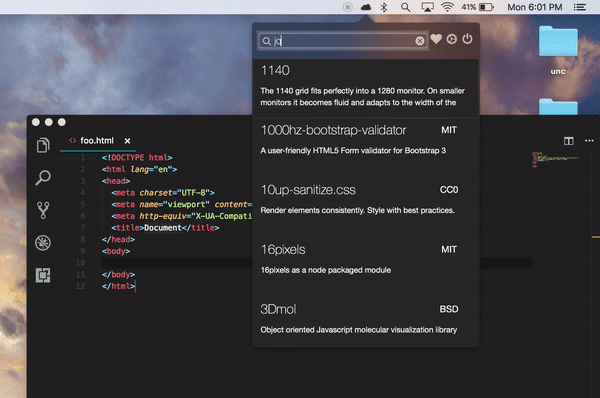

  

  
  
  
  

  A mac status bar app to make fetching assets quick and simple.

  

<h3 align="center">Fetching assets 📚</h3>

  

Easily search for and link assets from your status bar. You don't even have to leave your text editor!

 

<h3 align="center">Pick your favorites ❤️</h3>

  

Add your go-to assets to your favorites, and you don't even have to search for them.

 

<h3 align="center">Launch on startup 🚀</h3>

  

CDN Fetch is very low profile, which makes it very suitable for launching on startup.

<h2>License 📜</h2>

  &copy; 2017 <a href="https://github.com/charliekenney23">Charles Kenney</a>

